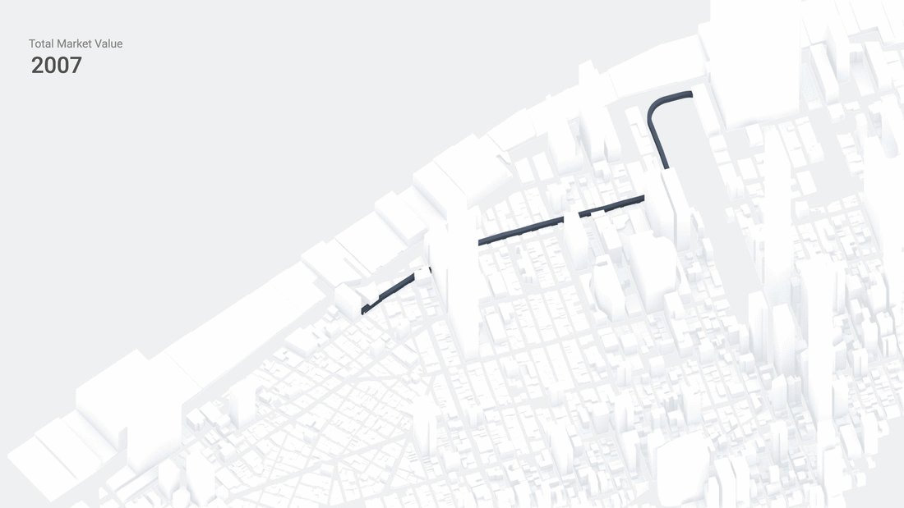
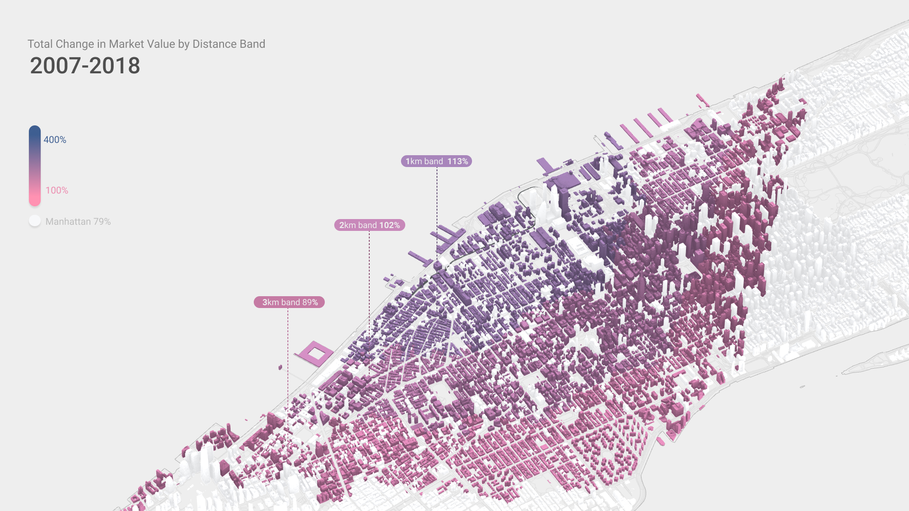
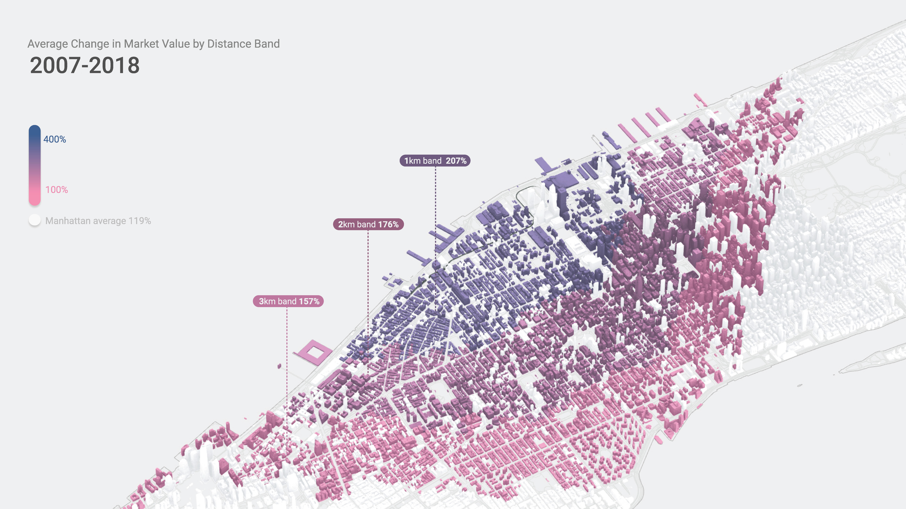

# Smart Covenant

## Introduction

The High Line is a 1.45-mile-long (2.33 km) elevated linear park, greenway and rail trail created on a former New York Central Railroad spur on the west side of Manhattan in New York City. It was opened in June 2009 and funded mostly with public money.

In this study we estimate the impact of opening the High Line Park in New York City on private property values in the surrounding areas.

Using publically available data we built a model to study property values change in relation to their proximity to High Line.

*Result - how to frame the new construction question?*

## Methodology

### Dataset choice:

We closely looked at property prices in Manhattan, from 2007 till 2018 using  publicly available data from [nyc.gov](https://www1.nyc.gov/).

[“Property Assessment”](https://www1.nyc.gov/site/finance/taxes/property-assessments.page) is the primary dataset for our analysis. It is being done for taxation purposes and has consistent data from 2007 till 2018, it correlates with [“Rolling Sales Data”](https://www1.nyc.gov/site/finance/taxes/property-rolling-sales-data.page) dataset.

<p align="center"></p>

*We filtered properties that were sold over the period of time from 2007 till 2018 and compared their assessed value to the amount of actual sales to make sure the datasets have high level of correlation.*

### Dataset preparation:

For the purposes of this analysis we had to slightly modify the existing dataset.

The way the dataset locates each property is through assigning them a block number and a tax lot. While blocks always remain unchanged, sometimes lots will be divided or united (or split between land value and apartment value as in case of condos), which makes it impossible to make “apples to apples” comparison of property values over time. Different property types that are recorded in different ways. Many lots change land use and [tax class](https://www1.nyc.gov/site/finance/taxes/property-tax-rates.page). In order to overcome this issue we have substituted each property’s lot, assigned in the dataset to a synthetic parent lot. This is done through uniting lots that changed shape over the period of time from 2007 till 2018 and adding all the values within one synthetic parent lot. In this way, we will be able to assess how a set of same properties changed value over time.  

```sql
SELECT
    CASE
        WHEN
            ap_lot = 0 THEN
            lot ELSE ap_lot
        END AS aplot,
    CASE
        WHEN
            ap_block = 0 THEN
            block ELSE ap_block
        END AS apblock,
    cur_fv_t,
    year4
FROM
    `property assessments`
GROUP BY
    apblock,
    aplot,
    year4
```

### Property value change:

Next, we calculate coefficients of value changes over time, with an increment of one year. This is done by dividing the cumulative value of properties within one synthetic parent lot  in a particular year and dividing it on the same value for the previous year.

<!---
```cs
code placeholder
```
--->

*We did not filter new construction in this. But caped max value growth at 100000%*
<p align="center"></p>

### High Line effect and distance bands:

We’ve used data from [NYC Street Centerline](https://data.cityofnewyork.us/Business/Zip-Code-Boundaries/i8iw-xf4u) to calculate distances from each of our newly generated lots to the High Line. Using [Closeness Centrality](https://en.wikipedia.org/wiki/Closeness_centrality) method we can find out how many miles one has to travel to reach High Line via sidewalks. We then divided the lots into four ranges of distance to High Line:

<p align="center"></p>

1. 0-1 km 
2. 1-2 km
3. 2-3 km
4. the rest of New York City

### Total value change per band:

By adding the values of synthetic plots within each band and comparing that value change over time we can see weather cumulative value of the distance band grew over a particular period of time.

<!---
```cs
code placeholder
```
--->

<p align="center"></p>

### General dynamic of property values in a band:

Having property values dynamics we can also find average property value change within each distance band.

<!---
```cs
code placeholder
```
--->

<p align="center"></p>

### Datasets used in this study

* [PLUTO](https://www1.nyc.gov/site/planning/data-maps/open-data/dwn-pluto-mappluto.page)
* [Property Assessment](https://www1.nyc.gov/site/finance/taxes/property-assessments.page)
* [Sales Data]()
* [NYC Street Centerline](https://data.cityofnewyork.us/Business/Zip-Code-Boundaries/i8iw-xf4u)
* [Building Footprints](https://data.cityofnewyork.us/Housing-Development/Building-Footprints/nqwf-w8eh)
