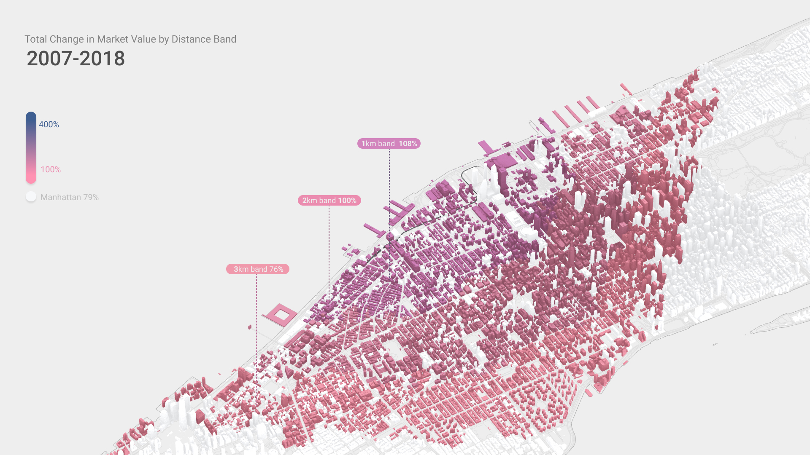

# Methodology

## Dataset choice:

We analysed property prices in Manhattan, between 2007 and 2018 using  publicly available data from [nyc.gov](https://www1.nyc.gov/).

[“Property Assessment”](https://www1.nyc.gov/site/finance/taxes/property-assessments.page) is the primary dataset for our analysis. It is collected for property tax calculations and has consistent data for 2007 to 2018, and it correlates well with the [“Rolling Sales Data”](https://www1.nyc.gov/site/finance/taxes/property-rolling-sales-data.page) dataset.

<p align="center"></p>

*We filtered properties that were sold over the period of time from 2007 to 2018 and compared their assessed value to their actual sales price, to make sure the datasets were well correlated.*

## Dataset preparation:

For the purposes of this analysis we had to slightly modify the existing dataset.

The way the dataset locates each property is through assigning them a block number and a tax lot. While blocks always remain unchanged, sometimes lots will be divided or united (or split between land value and apartment value as in the case of condos), which makes it impossible to make an “apples to apples” comparison of property values over time. Different property types are recorded in different ways and many lots change land use and [tax class](https://www1.nyc.gov/site/finance/taxes/property-tax-rates.page). In order to overcome this issue we have substituted each property’s lot, assigned in the dataset to a synthetic parent lot. This is done through uniting lots that changed shape over the period of time from 2007 to 2018 and adding all the values within one synthetic parent lot. In this way, we will be able to assess how a sets of properties changed value over time.  

<details><summary>Show details</summary>
<p>

```sql
SELECT
    CASE
        WHEN
            ap_lot = 0 THEN
            lot ELSE ap_lot
        END AS aplot,
    CASE
        WHEN
            ap_block = 0 THEN
            block ELSE ap_block
        END AS apblock,
    cur_fv_t,
    year4
FROM
    `property assessments`
GROUP BY
    apblock,
    aplot,
    year4
```
</p>
</details>

### Property value change:

Next, we calculated the coefficients of value change for each year. This is done by calculating the cumulative value of properties, within one synthetic parent lot, in a particular year and dividing it by the same value from the previous year.

<p align="center"></p>

<details><summary>Show details</summary>
<p>

```sql
SELECT
	*
FROM
	(
SELECT
	`years`.`block` AS `block`,
	`years`.`lot` AS `lot`,
	COALESCE ( sum( `years`.`07` ), 0 ) AS `2007`,
	COALESCE ( sum( `years`.`08` ), 0 ) AS `2008`,
	COALESCE ( sum( `years`.`09` ), 0 ) AS `2009`,
	COALESCE ( sum( `years`.`10` ), 0 ) AS `2010`,
	COALESCE ( sum( `years`.`11` ), 0 ) AS `2011`,
	COALESCE ( sum( `years`.`12` ), 0 ) AS `2012`,
	COALESCE ( sum( `years`.`13` ), 0 ) AS `2013`,
	COALESCE ( sum( `years`.`14` ), 0 ) AS `2014`,
	COALESCE ( sum( `years`.`15` ), 0 ) AS `2015`,
	COALESCE ( sum( `years`.`16` ), 0 ) AS `2016`,
	COALESCE ( sum( `years`.`17` ), 0 ) AS `2017`,
	COALESCE ( sum( `years`.`18` ), 0 ) AS `2018` 
FROM
	(
SELECT
	`property assessments filtered`.`apblock` AS `block`,
	`property assessments filtered`.`aplot` AS `lot`,
	`property assessments filtered`.`cur_fv_t` AS `cur_fv_t`,
	`property assessments filtered`.`year` AS `year`,
	( CASE WHEN ( `property assessments filtered`.`year` = 2007 ) THEN `property assessments filtered`.`cur_fv_t` END ) AS `07`,
	( CASE WHEN ( `property assessments filtered`.`year` = 2008 ) THEN `property assessments filtered`.`cur_fv_t` END ) AS `08`,
	( CASE WHEN ( `property assessments filtered`.`year` = 2009 ) THEN `property assessments filtered`.`cur_fv_t` END ) AS `09`,
	( CASE WHEN ( `property assessments filtered`.`year` = 2010 ) THEN `property assessments filtered`.`cur_fv_t` END ) AS `10`,
	( CASE WHEN ( `property assessments filtered`.`year` = 2011 ) THEN `property assessments filtered`.`cur_fv_t` END ) AS `11`,
	( CASE WHEN ( `property assessments filtered`.`year` = 2012 ) THEN `property assessments filtered`.`cur_fv_t` END ) AS `12`,
	( CASE WHEN ( `property assessments filtered`.`year` = 2013 ) THEN `property assessments filtered`.`cur_fv_t` END ) AS `13`,
	( CASE WHEN ( `property assessments filtered`.`year` = 2014 ) THEN `property assessments filtered`.`cur_fv_t` END ) AS `14`,
	( CASE WHEN ( `property assessments filtered`.`year` = 2015 ) THEN `property assessments filtered`.`cur_fv_t` END ) AS `15`,
	( CASE WHEN ( `property assessments filtered`.`year` = 2016 ) THEN `property assessments filtered`.`cur_fv_t` END ) AS `16`,
	( CASE WHEN ( `property assessments filtered`.`year` = 2017 ) THEN `property assessments filtered`.`cur_fv_t` END ) AS `17`,
	( CASE WHEN ( `property assessments filtered`.`year` = 2018 ) THEN `property assessments filtered`.`cur_fv_t` END ) AS `18` 
FROM
	`property assessments filtered` 
	) `years` 
GROUP BY
	`years`.`block`,
	`years`.`lot` 
	) `select` 
WHERE
 COALESCE(((`select`.`2018` / `select`.`2007` ) - 1),1)  < 10 
```

| Block  | Lot | 2007 | 2008 | 2009 | 2010  | 2011  | 2012  | 2013  | 2014  | 2015  | 2016  | 2017  | 2018  |
|-----|----|---------|---------|---------|----------|----------|----------|----------|----------|----------|----------|----------|----------|
| 78  | 40 | 4500000 | 6760000 | 6080000 | 6140000  | 6158000  | 6212000  | 6260000  | 6070000  | 7076000  | 6015000  | 5999000  | 6309000  |
| 97  | 17 | 4100000 | 4820000 | 4340000 | 4990000  | 5005000  | 5049000  | 4458600  | 4952000  | 5088000  | 5088000  | 6106000  | 6421000  |
| 97  | 36 | 3800000 | 6365484 | 5730000 | 6590000  | 6610000  | 6668000  | 6719000  | 8063000  | 7401000  | 6291000  | 7549000  | 7939000  |
| 97  | 44 | 3480000 | 2470000 | 2220000 | 2550000  | 2678000  | 2758000  | 2344000  | 2333000  | 1983000  | 2677000  | 3614000  | 4556000  |
| 97  | 45 | 1770000 | 2230000 | 2010000 | 2310000  | 2317000  | 2387000  | 2029000  | 2020000  | 2424000  | 3272000  | 4417000  | 5741000  |
| 97  | 55 | 1394000 | 5000000 | 4500000 | 4730000  | 7095000  | 8514000  | 7237000  | 7203000  | 8644000  | 11669000 | 15753000 | 15196000 |
| 106 | 2  | 308000  | 339000  | 340000  | 1780000  | 4130000  | 4956000  | 9894225  | 9848000  | 8371000  | 11301000 | 15256000 | 12767000 |
| 106 | 6  | 1790000 | 4900000 | 4410000 | 5070000  | 5085000  | 5129000  | 5168000  | 6202000  | 5272000  | 5177000  | 5501000  | 5901000  |
| 132 | 26 | 2100000 | 2100000 | 3082000 | 3207000  | 3219000  | 3247000  | 3272000  | 3926000  | 4711000  | 5653000  | 6784000  | 7134000  |
| 135 | 11 | 1231000 | 1420000 | 1711000 | 4750000  | 5523000  | 6628000  | 6679000  | 8015000  | 9104000  | 12290000 | 16592000 | 27681000 |
| ... | ... | ... | ... | ... | ... | ... | ... | ... | ... | ... | ... | ... | ... |
</p>
</details>

#### Value Uplift to Total Market Value at 2018 distribution in 500m band


*We did not filter out new construction in this, but capped max value growth at 100000%*

### High Line effect and distance bands:

We’ve used data from [NYC Street Centerline](https://data.cityofnewyork.us/Business/Zip-Code-Boundaries/i8iw-xf4u) to calculate distances from each of our newly generated lots to the High Line. Using the [Closeness Centrality](https://en.wikipedia.org/wiki/Closeness_centrality) method we can calculate how many kilometres you would have to travel to reach High Line via sidewalks. We then divided the lots into four distance ranges to High Line:

<p align="center"></p>

<details><summary>Show details</summary>
<p>

#### Distance to High Line

| Block | Lot |Stage 1 - 2009 | Stage 2 - 2014  | Stage 3 - 2019  | Radius |
|------|:---|:-----------|:------------|:------------|:--------|
| 675  |  38 |    3261.91 | 742.15     | 405.71     | 93     |
| 716  |  3  |     413.25 | 413.25     | 413.25     | 208    |
| 715  |  63 |     413.25 | 413.25     | 413.25     | 189    |
| 716  | 1   | 413.25     | 413.25     | 413.25     | 208    |
| 716  | 2   | 413.25     | 413.25     | 413.25     | 208    |
| 716  | 5   | 413.25     | 413.25     | 413.25     | 284    |
| ...  | ...   | ...    | ...     | ...     | ...    |

#### Number of lots per band

| Band | Distance | Number of lots |
|------|-------|----------------|
| 1    |0-1 km |3130           |
| 2    |1-2 km |5143           |
| 3    |2-3 km |6091           |
| 4    |the rest of New York City |41029          |
</p>
</details>

### Total market value change per band:

Firstly we calculated the change in total market value of all properties within each band, between 2007 and 2018. Summing the values of synthetic plots within each band and tracking that value change over time. We can see how total market value of the band grew over the period.

<p align="center"></p>

<details><summary>Show details</summary>
<p>

```sql
SELECT
	(
CASE
	
	WHEN ( `cur_fv_t distance`.`distance` BETWEEN 0 AND 1000 ) THEN
	'1' 
	WHEN ( `cur_fv_t distance`.`distance` BETWEEN 1000 AND 2000 ) THEN
	'2' 
	WHEN ( `cur_fv_t distance`.`distance` BETWEEN 2000 AND 3000 ) THEN
	'3' ELSE '4' 
END 
	) AS `band`,
	count( `cur_fv_t distance`.`lot` ) AS `Number of Lots`,
	sum( `cur_fv_t distance`.`2007` ) AS `Total Market Value 2007`,
	sum( `cur_fv_t distance`.`2018` ) AS `Total Market Value 2018`,
	( ( sum( `cur_fv_t distance`.`2018` ) / sum( `cur_fv_t distance`.`2007` ) ) - 1 ) AS `Total Value Uplift` 
FROM
	`cur_fv_t distance` 
GROUP BY
`band`
```


| Band | Number of Lots |  2007 |  2018 | Value Uplift |
|------|:--------------:|:------------------------|:-------------------------|---|
| 1    |      3130      |             16676541094 |             34828934875 | 108% |
| 2    |      5143      |             37275969508 |             74577136328 | 100% |
| 3    |      6091      |             54172760793 |             95148666916 | 76% |

```sql
SELECT
	COUNT(`lot`) AS `Number of Lots`,
	SUM(`2007`) AS `Total Market Value 2007`,
	SUM(`2018`) AS `Total Market Value 2018`,
	SUM(`2018`)/SUM(`2007`)-1 AS `Value Uplift`
FROM `cur_fv_t yearly`
```

| Number of Lots |  2007 |  2018 | Value Uplift |
|:--------------:|:------------------------|:-------------------------|---|
|      55393| 271237511685 | 486144719625 | 79% |

</p>
</details>

### Average individual property value change by band:

We then analysed individual properties and calculated the value uplift they each experienced over the period, taking a mean of these values within each band. This shows the average value uplift experienced by individual landowners rather than a measure of the total market uplift. 

<p align="center"></p>

<details><summary>Show details</summary>
<p>

```sql
SELECT
	(
CASE
	
	WHEN ( `cur_fv_t distance`.`distance` BETWEEN 0 AND 1000 ) THEN
	'1' 
	WHEN ( `cur_fv_t distance`.`distance` BETWEEN 1000 AND 2000 ) THEN
	'2' 
	WHEN ( `cur_fv_t distance`.`distance` BETWEEN 2000 AND 3000 ) THEN
	'3' ELSE '4'
END 
	) AS `band`,
	avg( COALESCE ( ( ( `cur_fv_t distance`.`2018` / `cur_fv_t distance`.`2007` ) - 1 ), 1 ) ) AS `Value Uplift` 
FROM
	`cur_fv_t distance`
GROUP BY
`band`
```

| Band | Average Value uplift |
|-|-|
|1|207%|
|2|176%|
|3|157%|
</p>
</details>

## Calculating additional property tax generated by High Line

To calculate additional property tax revenue received by the government as a result of High Line, we calculated the difference between the total market value of nearby properties if they were to have grown at the Manhattan mean rate and compared this to their actual growth. We then calculated the additional property tax revenue generated by this extra uplift, taking into account the different tax classes, assessed values and deductions relevant to NYC property taxation.


## Datasets used in this study

* [PLUTO](https://www1.nyc.gov/site/planning/data-maps/open-data/dwn-pluto-mappluto.page)
* [Property Assessment](https://www1.nyc.gov/site/finance/taxes/property-assessments.page)
* [Sales Data]()
* [NYC Street Centerline](https://data.cityofnewyork.us/Business/Zip-Code-Boundaries/i8iw-xf4u)
* [Building Footprints](https://data.cityofnewyork.us/Housing-Development/Building-Footprints/nqwf-w8eh)
